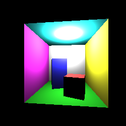

# Ray Tracer

Ray Tracer for the University of Bristol Computer Graphics course (course work 1), links with the [Rasteriser](https://github.com/harrymt/rasterizer/).

See the [report](report.pdf) for a full overview.

## How to Build

- Download a copy of [GLM](http://glm.g-truc.net) and place it inside of the root directory.
- Then use [Makefile](Makefile) to build the program by running the following command in the directory.

```
make
```

- A rendered image of the [Cornell Box](https://en.wikipedia.org/wiki/Cornell_box) should appear.


## Latest Rendered Image




## Features

Basic components of a ray tracer were implemented along with the following extensions:

- Anti-Aliasing with SSAA
- Soft-Shadows
- Parallelisation - CPU
- General Model Loading
- Photon Mapping
- Approximating Global Illumination (Indirect Illumination and Colour Bleeding
- Range Trees and KD-Trees
- Photon Mapping Optimisations
- Improving Photon Mapping Quality

## Technologies

Uses the following technologies:

- [SDL](http://www.libsdl.org)
- [GLM](http://glm.g-truc.net)
